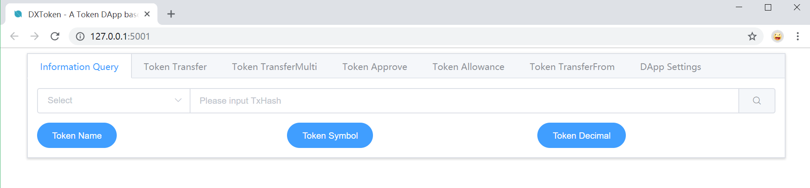

# ontology-tutorialtoken



## Unboxing the Dapp

- Install Ontology Dapp Box.

```shell
pip install OBox
```

- Install ontology-python-sdk

```shell
pip install ontology-python-sdk
```

- Download the box. This also takes care of installing the necessary dependencies.

```shell
OBox --install tutorialtoken
```

## Creating Smart Contract

With our front-end taken care of, we can focus on the `oep4_token` contract.

- In the `contracts/` directory of your `OBox`, create the file `oep4_token.py` and add the following contents:

```python
from boa.interop.System.Storage import GetContext, Get, Put, Delete
from boa.interop.System.Runtime import Notify, CheckWitness
from boa.builtins import concat, ToScriptHash

ctx = GetContext()
```

- To set our own parameters for the token, we'll be declaring our own name, symbol, and other details. Add the following content block to the contract (between the curly braces):

```python
NAME = 'DXToken'
SYMBOL = 'DX'
DECIMAL = 2
FACTOR = 100000000
OWNER = ToScriptHash("AUQ2cqRs2daQBqTFs6Zun8eYXRe4a9JZUC")
TOTAL_AMOUNT = 1000000000
```

Things to notice:

- The `NAME` and `SYMBOL` variables give our token a unique identity.
- The `DECIMAL` variable determines the degree to which this token can be subdivided. For our example we went with 2 decimal places, similar to dollars and cents.
- The `TOTAL_AMOUNT` variable determines the number of tokens created when this contract is deployed. In this case, the number is arbitrary.

- Implement OEP4 Interface in Smart Contract

According to[ OEP-Token-Standard](https://github.com/ontio/OEPs/blob/1d9234f2f09fbc0ef9bcf29b6cfca164ff356c52/OEP-4/), we need to add 10 interface for our Token.

|       | Main Function      |
| :---: | :----------------- |
| 1     | init()             |
| 2     | get_name()         |
| 3     | get_symbol()       |
| 4     | get_decimal()      |
| 5     | get_total_supply() |
| 6     | approve()          |
| 7     | allowance()        |
| 8     | balance_of()       |
| 9     | transfer()         |
| 10    | transfer_multi()   |
| 11    | transfer_from()    |

In our [ontology-python-sdk](https://pypi.org/project/ontology-python-sdk/), we have implement the calling interface for your. If you want to know more details, you can visit our [Ontology Python SDK API Reference](https://apidoc.ont.io/pythonsdk/#oep4).