# ontology-tutorialtoken

<!-- TOC -->

- [1. Introduction](#1-introduction)
- [2. Setting up the development environment](#2-setting-up-the-development-environment)
- [3. Getting started](#3-getting-started)
    - [3.1. Unboxing the DApp](#31-unboxing-the-dapp)
    - [3.2. Creating Smart Contract](#32-creating-smart-contract)
    - [3.3. Implement the Interface of OEP4 Contract](#33-implement-the-interface-of-oep4-contract)
        - [3.3.1. Support Getting the Parameters of Token](#331-support-getting-the-parameters-of-token)
        - [3.3.2. Initialize Token Parameter](#332-initialize-token-parameter)
    - [3.4. Support Check Balance](#34-support-check-balance)
    - [3.5. Support Transfer](#35-support-transfer)
        - [3.5.1. Transfer](#351-transfer)
        - [3.5.2. TransferMulti](#352-transfermulti)
        - [3.5.3. TransferFrom](#353-transferfrom)
- [4. Run your DApp](#4-run-your-dapp)
- [5. Use your DApp](#5-use-your-dapp)
    - [5.1. Information Query](#51-information-query)
    - [5.2. Token Transfer](#52-token-transfer)
    - [5.3. Token TransferMulti](#53-token-transfermulti)
    - [5.4. Token Approve](#54-token-approve)
    - [5.5. Token Allowance](#55-token-allowance)
    - [5.6. Token TransferFrom](#56-token-transferfrom)
    - [5.7. DApp Settings](#57-dapp-settings)

<!-- /TOC -->

## 1. Introduction

The [OEP4 token standard](https://github.com/ontio/OEPs/blob/1d9234f2f09fbc0ef9bcf29b6cfca164ff356c52/OEP-4/OEP-Token-Standard.mediawiki) describes the functions and events that an Ontology token contract has to implement.

Specifically, In OEP4, we need to implement the following interface for our OEP4 Token.

|    | Interface          | Description                                                                                 |
|:--:|:-------------------|:--------------------------------------------------------------------------------------------|
| 1  | init()             | initialize smart contract parameter                                                         |
| 2  | get_name()         | return the name of an oep4 token                                                            |
| 3  | get_symbol()       | return the symbol of an oep4 token                                                          |
| 4  | get_decimal()      | return the number of decimals used by the oep4 token                                        |
| 5  | get_total_supply() | return the total supply of the oep4 token                                                   |
| 6  | approve()          | allows spender to withdraw a certain amount of oep4 token from owner account multiple times |
| 7  | allowance()        | query the amount of spender still allowed to withdraw from owner account                    |
| 8  | balance_of()       | query the ope4 token balance of the given base58 encode address                             |
| 9  | transfer()         | transfer an amount of tokens from one account to another account                            |
| 10 | transfer_multi()   | transfer amount of token from multiple from-account to multiple to-account multiple times   |
| 11 | transfer_from()    | allow spender to withdraw amount of oep4 token from from-account to to-account              |

Benefit from [Ontology Python Sdk](https://pypi.org/project/ontology-python-sdk/), we can easily calling OEP4 interface by Python. If you want to know more details, you can read our [Ontology Python SDK API Reference](https://apidoc.ont.io/pythonsdk/#oep4).

## 2. Setting up the development environment

There are a few technical requirements before we start. Please install the following:

- [Python 3.7](https://www.python.org/downloads/release/python-370/)
- [Git](https://git-scm.com/)

## 3. Getting started

### 3.1. Unboxing the DApp

Install Ontology DApp Box.

```shell
pip install OBox
```

Download the DApp box.

```shell
OBox --install tutorialtoken
```

Create virtual environments(optional).

```shell
virtualenv --no-site-packages venv
```

Install the necessary dependencies.

```shell
pip install -r requirements.txt
```

### 3.2. Creating Smart Contract

With our front-end taken care of, we can focus on the `oep4_token` contract.

In the `contracts/` directory of your `OBox`, create the file `oep4_token.py` and add the following contents:

```python
from boa.interop.System.Storage import GetContext, Get, Put, Delete
from boa.interop.System.Runtime import Notify, CheckWitness
from boa.builtins import concat, ToScriptHash

ctx = GetContext()
```

The interface `GetContext()` is used to get current storage context in smart contract.

**NOTE**: Storage is an important conception in Ontology Blockchain, which maintain a key-value storage context that used to save the global variable.

- We can use `Put()` interface to insert data into a persistent storage area in the from of key-value.
- We can use `Get()` interface to get value by key from a persistent storage area.

To set our own parameters for the token, we'll be declaring our own name, symbol, and other details. Add the following content block to the contract:

```python
NAME = 'DXToken'
SYMBOL = 'DX'
DECIMAL = 2
FACTOR = 100000000
OWNER = ToScriptHash("AUQ2cqRs2daQBqTFs6Zun8eYXRe4a9JZUC")
TOTAL_AMOUNT = 1000000000

SUPPLY_KEY = 'totoalSupply'

TRANSFER_PREFIX = bytearray(b'\x01')
APPROVE_PREFIX = bytearray(b'\x02 ')
```

Things to notice:

- The `NAME` and `SYMBOL` variables give our token a unique identity.
- The `DECIMAL` variable determines the degree to which this token can be subdivided. For our example we went with 2 decimal places, similar to dollars and cents.
- The `TOTAL_AMOUNT` variable determines the number of tokens created when this contract is deployed. In this case, the number is arbitrary.
- The `SUPPLY_KEY`, `TRANSFER_PREFIX` and `APPROVE_PREFIX` variable will be used in storage.

### 3.3. Implement the Interface of OEP4 Contract

#### 3.3.1. Support Getting the Parameters of Token

Now, we want to get the parameters of the token, we can just return them.

- **Token Name**

```python
def Name():
    return NAME
```

- **Token Symbol**

```python
def Symbol():
    return SYMBOL
```

- **Token Decimal**

```python
def Decimal():
    return DECIMAL
    
```

- **Token Total Supply**

The difference between the two following code is if you use `Get(ctx,SUPPLY_KEY)` to acquire the total supply of your OEP4 Token, you need to initialize the total supply by using `Put(ctx, SUPPLY_KEY, total)` operation.

```python
def TotalSupply():
    return TOTAL_AMOUNT * FACTOR
```

```python
def TotalSupply():
    return Get(ctx,SUPPLY_KEY)
```

#### 3.3.2. Initialize Token Parameter

In Ontology smart contract, `Notify()` is an interface that used to send notifications (including socket notifications or rpc queries) to clients that are executing this smart contract.

Therefore, if you want to record something public into the Ontology Blockchain, you can use the interface `Notify()`.

```python
def Init():
    if Get(ctx, SUPPLY_KEY):
        Notify('Already initialized!')
        return False
    else:
        total = TOTAL_AMOUNT * FACTOR
        Put(ctx, SUPPLY_KEY, total)
        Put(ctx, concat(TRANSFER_PREFIX, OWNER), total)
        Notify(['transfer', '', OWNER, total])
        return True
```

**NOTE**: By the help of `Put(ctx, concat(TRANSFER_PREFIX, OWNER), total)`, we allot all token to onwer.

### 3.4. Support Check Balance

We can maintain an account book in smart contract's storage context, by using `Put()`, `Get()` and allot an unique `key` for earch account.

```python
def BalanceOf(account):
    return Get(ctx, concat(TRANSFER_PREFIX, account))
```

### 3.5. Support Transfer

#### 3.5.1. Transfer

`CheckWitness` interface is used to verify operational permissions of account or contract. We don't want our tokens to be spent by others, so we need to verify operational permissions.

```python
def Transfer(from_acct, to_acct, amount):
    if from_acct == to_acct:
        return True
    if amount == 0:
        return True
    if amount < 0:
        return False
    if CheckWitness(from_acct) == False:
        return False
    if len(to_acct) != 20:
        return False
    fromKey = concat(TRANSFER_PREFIX, from_acct)
    fromBalance = Get(ctx, fromKey)
    if fromBalance < amount:
        return False
    if fromBalance == amount:
        Delete(ctx, fromKey)
    else:
        Put(ctx, fromKey, fromBalance - amount)

    tokey = concat(TRANSFER_PREFIX, to_acct)
    toBalance = Get(ctx, tokey)

    Put(ctx, tokey, toBalance + amount)
    Notify(['transfer', from_acct, to_acct, amount])
    return True
```

#### 3.5.2. TransferMulti

```python
def TransferMulti(args):
    for p in (args):
        if len(p) != 3:
            return False
        if Transfer(p[0], p[1], p[2]) == False:
            raise Exception("TransferMulti failed!")
    return True
```

#### 3.5.3. TransferFrom

```python
def TransferFrom(sender, from_acct, to_acct, amount):
    if amount < 0:
        return False
    if CheckWitness(sender) == False:
        return False
    if len(to_acct) != 20:
        return False
    appoveKey = concat(concat(APPROVE_PREFIX, from_acct), sender)
    approvedAmount = Get(ctx, appoveKey)
    if approvedAmount < amount:
        return False
    if approvedAmount == amount:
        Delete(ctx, appoveKey)
    else:
        Put(ctx, appoveKey, approvedAmount - amount)

    fromKey = concat(TRANSFER_PREFIX, from_acct)
    fromBalance = Get(ctx, fromKey)
    if fromBalance < amount:
        return False
    if fromBalance == amount:
        Delete(ctx, fromKey)
    else:
        Put(ctx, fromKey, fromBalance - amount)

    tokey = concat(TRANSFER_PREFIX, to_acct)
    toBalance = Get(ctx, tokey)

    Put(ctx, tokey, toBalance + amount)
    Notify(['transfer', from_acct, to_acct, amount])
    return True
```

## 4. Run your DApp

At this point, you can run the DApp in your browser:

```shell
python tutorial_token.py
```

- If everything goes smoothly, your DApp will run on http://127.0.0.1:5001/. 

- If you want to quit it, you can press CTRL+C or close the terminal.


## 5. Use your DApp

### 5.1. Information Query

As a tutorial project, we provide an example about how to query some basic information with the help of ontology-python-sdk.

- **Query Token Name**

In our tutorial project, you can query an OEP4 Token's name in the way of following.

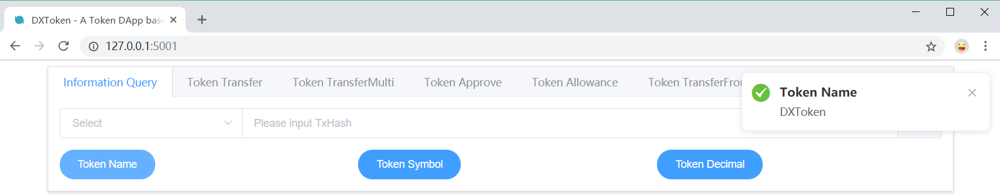

- **Query Token Symbol**

In our tutorial project, you can query an OEP4 Token's symbol in the way of following.


- **Query Token Decimals**

In our tutorial project, you can query an OEP4 Token's decimals in the way of following.


- **Query Balance**

As a tutorial project, we provide an example about how to query a account's balance, including ONT, ONG and OEP4 Token.

You can query the **ONT** balance of an account in the way of following.


You can query the **ONG** balance of an account in the way of following.


You can query the **OEP4 Token** balance of an account in the way of following.

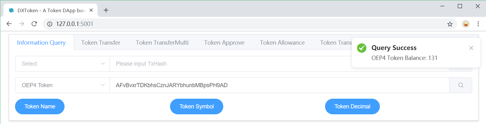

### 5.2. Token Transfer

Before you transfer, you can check the account's balance which will receive the OEP4 Token.


You can paste an base58 encode address and input a value you want to transfer.

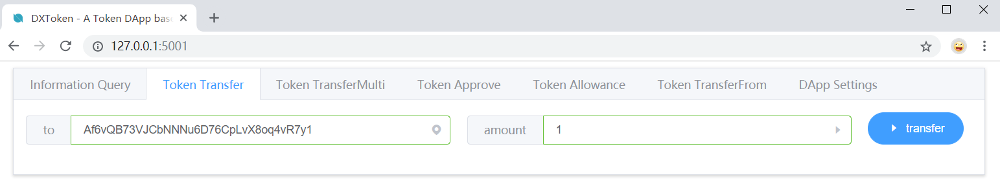

In our tutorial project, we need you to provide account's password for the basic security of your account.

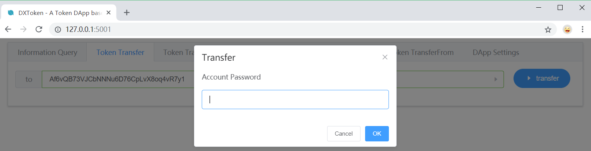

As an tutorial project, we need you to confirm your transaction before send it network, because it involve to Token which is an important digital asset in Blockchain.

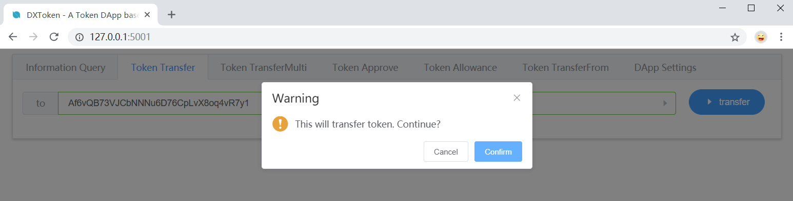

As you can see, if everything goes smoothly, you will receive an hexadecimal TxHash, which you can used to query the information of your transaction.

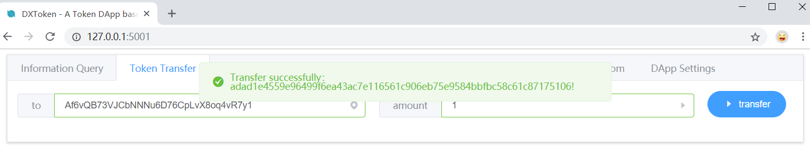

As an example, we query the `Notify` of this transaction, which contain the information of this OEP4 transaction.


In the first `Notify`, the contract address `8eecb19cd0fd311119feeb02c424476396d95096` correspond to the OEP4 smart contract you are using and the `States` information in it correspond to the parameters in your contract’s `Notify`.

```json
[
    {
        "ContractAddress":"8eecb19cd0fd311119feeb02c424476396d95096",
        "States":[
            "7472616e73666572",
            "4756c9dd829b2142883adbe1ae4f8689a1f673e9",
            "ffe5182c75aa0ae2ede8b59aca857ea39666f1ff",
            "01"
        ]
    },
    {
        "ContractAddress":"0200000000000000000000000000000000000000",
        "States":[
            "transfer",
            "ANH5bHrrt111XwNEnuPZj6u95Dd6u7G4D6",
            "AFmseVrdL9f9oyCzZefL9tG6UbviEH9ugK",
            10000000
        ]
    }
]
```

Therefore, we have the following corresponding relation:

- `7472616e73666572`: the string of `transfer` in the form of hexadecimal string, which can be decoded easily with the python code `bytes.fromhex('7472616e73666572').decode()`.

- `4756c9dd829b2142883adbe1ae4f8689a1f673e9`: the address of send account in the form of hexadecimal string, which can be converted to base58 encode address easily with the python code `Address.b58decode('4756c9dd829b2142883adbe1ae4f8689a1f673e9').to_hex_str()`.

- `ffe5182c75aa0ae2ede8b59aca857ea39666f1ff`: the address of receive account in the form of hexadecimal string.

- '01': the amount token transfered in this transaction. If you want to convert it to int, you can use the following code:

```python
import binascii

balance = '01'
array = bytearray(binascii.a2b_hex(balance.encode('ascii')))
array.reverse()
balance = int(binascii.b2a_hex(array).decode('ascii'), 16)
```

### 5.3. Token TransferMulti

### 5.4. Token Approve

### 5.5. Token Allowance

### 5.6. Token TransferFrom

### 5.7. DApp Settings

When you select this tab, you can see the following interface:

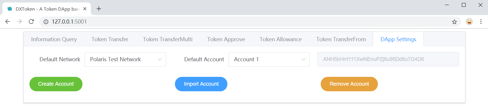

- **Select Default Network**

As a tutorial project, we provide an example about how to support different network in a DApp, such as main network, test network and local network.


In our tutorial project, if you connect to a new node successfully, you will receive the following message.


In our tutorial project, if you want to connect to a local node, please make sure you have run it in your computer before you connect, or you will receive the following message.


For more details, you can visit [Ontology](https://github.com/ontio/ontology). 

- **Select Default Account**

As a tutorial project, we provide an example about how to support multi wallet account management in a DApp.


In our tutorial project, when the DApp start, it will read the wallet file in your computer, then initialize the wallet account for you.

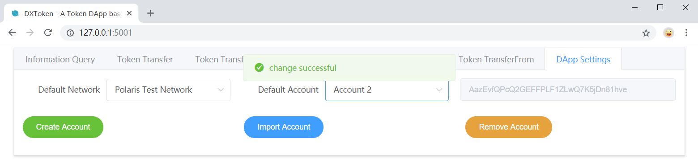

- **Create Account**

As a tutorial project, we provide an example about how to create new account in a DApp.

In our tutorial project, you **must** input a label for your account, which is a basic way to help your identify different accounts.

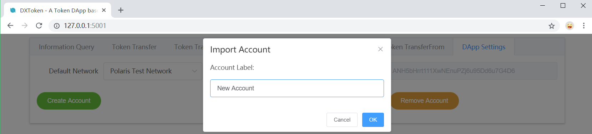

Therefore, if you not input a correct label, you will receive the following message.


In our tutorial project, you **must** set a password for your account. This password will used to encrypt and decrypt your account's private key, which is an basic way to protect account's security.

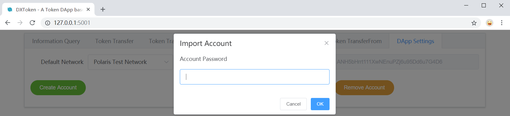

Therefore, if you not input a correct password, you will receive the following message.


If everything goes smoothly, your will get a hexadecimal private key in message box like the following.


Now, you can switch to your new accout.


- **Import Account**

As a tutorial project, we provide an example about how to import a account into a DApp  based on hexadecimal private key.

In our tutorial project, you should paste a private key string into the input box.


**NOTE**: The length of your hexadecimal private key should be 64. if you input an error private key, you will get a notify.


In our tutorial project, you **must** input a label for your account, which is a basic way to help your identify different accounts.


In our tutorial project, you **must** set a password for your account. This password will used to encrypt and decrypt your account's private key, which is an basic way to protect account's security.


In our tutorial project, if you import account by private key successfully, you can see your new account in drop-down menu.


Now, you can get your new account's base58 encode address in the following box.

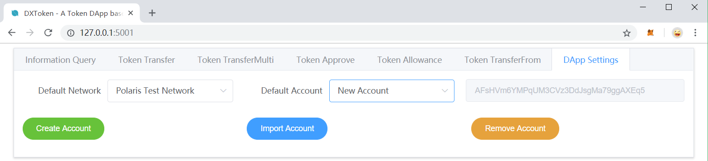

- **Remove Account**

As a tutorial project, we provide an example about how to remove a account from a DApp based on ontology-python-sdk.

In our tutorial project, you should provide a password to provide you have permission to manage this account.

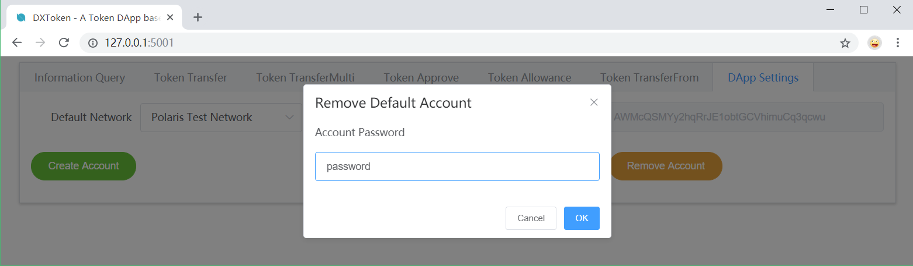

If everything goes smoothly, you will receive the following message.


Now, the account is removed from the `Default Accout` drop-down menu and also with the wallet file.

